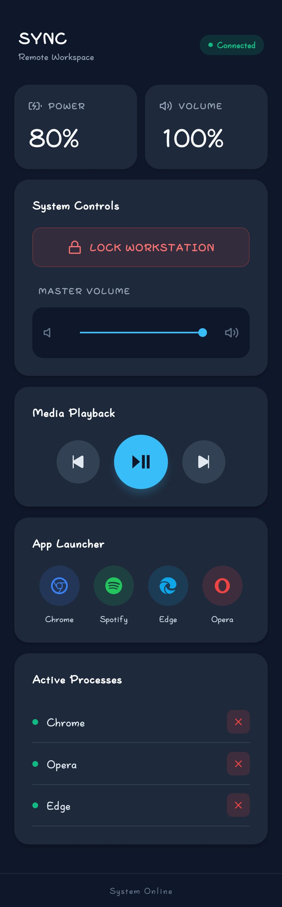

# SYNC Remote Workspace

**A Full-Stack, Multi-Process Windows System Orchestrator**



SYNC Remote is a localized, high-performance system service that transforms a mobile device into a comprehensive command center for a Windows PC. Engineered with a Master/Worker architecture, the system runs silently in the Windows System Tray, dynamically managing network tunnels and production-grade local web servers to bridge mobile commands directly to the Windows OS kernel, audio drivers, and process manager.

---

## Core Capabilities

* **Live Process Management:** Real-time fetching of active Windows tasks with the ability to remotely terminate (`taskkill`) applications.
* **Hardware & OS Interfacing:** Zero-latency control over the Windows Core Audio API (Volume) and native OS commands (Lock Workstation).
* **Media & Application Orchestration:** Global media playback controls and one-touch quick launching for heavy applications (Chrome, Spotify, IDEs).
* **Zero-Configuration Startup:** Automatically launches on Windows boot with self-aware absolute pathing, requiring zero terminal interaction from the user.
* **Master/Worker Architecture:** A lightweight system tray application (`tray_app`) acts as the Master, spawning and aggressively managing child processes (Flask Server and Ngrok) to prevent zombie memory leaks.
* **Production-Ready Backend:** Utilizes `Waitress` as a production WSGI server instead of the default Flask development server for multi-threaded stability.
* **Secure Local Tunneling:** Integrates Ngrok via Python's `subprocess` module to expose a static, secure endpoint without local router port-forwarding.

---

## System Architecture & Tech Stack

### The Tech Stack
* **Mobile Frontend:** React Native / Expo (Custom Neumorphic UI, State Management)
* **Backend Engine:** Python, Flask, Waitress
* **OS & Hardware Integration:** `pycaw` (Audio), `psutil` (Process Management), `os`/`subprocess` (App Launching)
* **Networking:** Ngrok (Reverse Proxy Tunneling)
* **Packaging:** PyInstaller (with `--onefile` and `--noconsole` configuration)

### The Data Flow
1. **The Master App (`SYNC_App.exe`):** Sits in the system tray. On launch, it dynamically calculates its OS path and spawns two hidden background workers (`server.exe` and `ngrok.exe`), setting strict Current Working Directories (CWD).
2. **The API Engine (`server.exe`):** A Flask application running on Waitress (Port 54321). It exposes RESTful endpoints (e.g., `/api/volume`, `/api/process/kill`, `/api/system/lock`).
3. **The Bridge:** The Ngrok worker binds to the local Flask port and projects it to a static, secure public URL defined in a hidden `.env` file.
4. **The Action:** The React Native app sends JSON payloads to the secure URL. Flask authenticates the request, interfaces with the respective Windows API, and returns the updated system state (like the new battery percentage or active process list) back to the mobile UI.

---

## Getting Started

### For End-Users (No Code Required)
1. Navigate to the [Releases](../../releases) tab on this repository.
2. Download the latest `SYNC_Release.zip` and extract it to a permanent location (e.g., your Desktop).
3. Rename `.env.example` to `.env` and insert your static Ngrok domain.
4. Double-click `SYNC_App.exe`. 
*(Optional: Create a shortcut of `SYNC_App.exe` and place it in your `shell:startup` folder for automatic boot).*

### For Developers (Local Setup)
To run the source code and modify the engine:

```bash
# 1. Clone the repository
git clone [https://github.com/YOUR_ACTUAL_NAME/SYNC_Remote_Server.git](https://github.com/YOUR_ACTUAL_NAME/SYNC_Remote_Server.git)
cd SYNC_Remote_Server

# 2. Create a virtual environment
python -m venv venv
venv\Scripts\activate

# 3. Install dependencies
pip install -r requirements.txt

# 4. Set up environment variables
cp .env.example .env
# Edit .env with your Ngrok domain and security PIN

# 5. Run the master app
python tray_app.py
